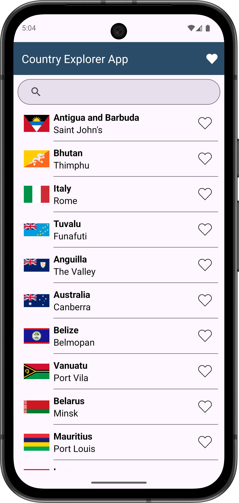
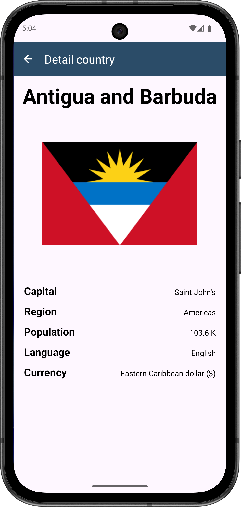
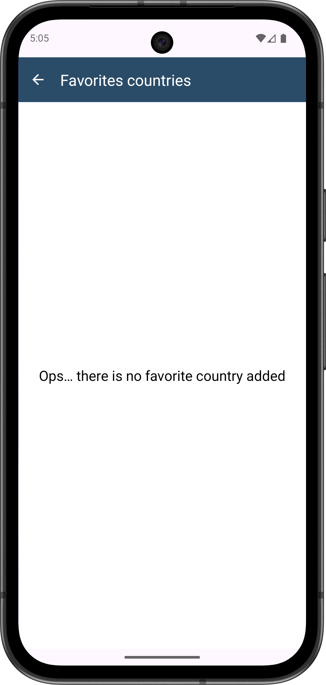
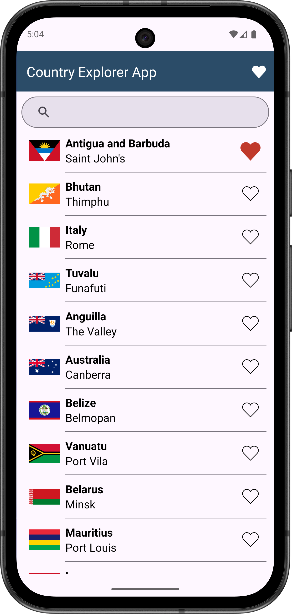
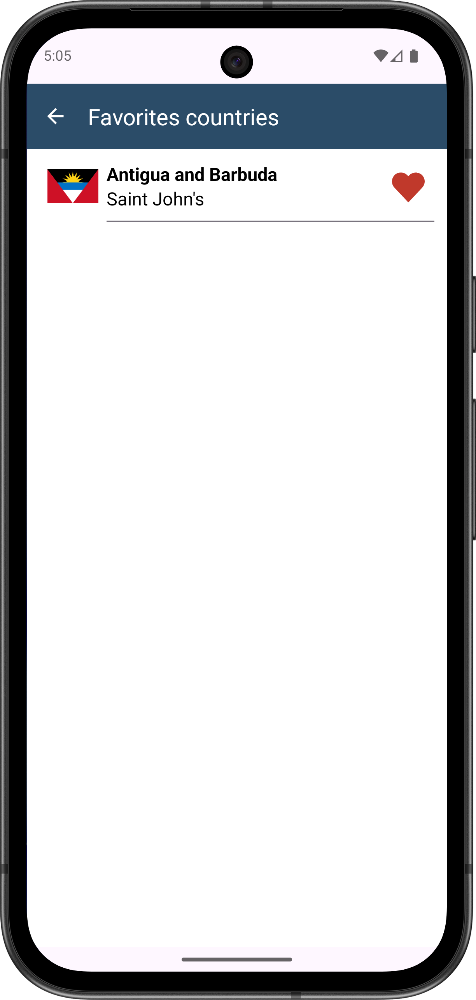

# 🌍 Country Explorer

**Country Explorer** is an Android app built with **Kotlin** to explore countries around the world using the **REST Countries API**.  
The project follows **Clean Architecture + MVVM**, with well-defined layers and a clear separation of concerns.

---

## 🧭 Overview

With Country Explorer you can:

- List countries available in the API
- Search countries by **name / region / capital**
- View details (flag, capital, population, languages, currencies)
- Navigate between screens using **Navigation Component + SafeArgs**
- Mark/unmark **favorites** (in-memory)

---

## ✨ Features

- ✅ Countries list with flag, name, and capital
- 🔍 Search (name/region/capital) with dynamic updates
- 📄 Details screen: capital, population (**K/M/B**), languages, currencies
- ⭐ Favorites toggle and favorites screen

---

## ⚙️ Technologies & Concepts

- **Kotlin**
- **XML + ViewBinding**
- **MVVM Architecture (ViewModel + LiveData)**
- **Clean Architecture** (layers: `data`, `domain`, `presentation`)
- **Retrofit + Coroutines** for API consumption
- **Navigation Component + SafeArgs**
- **Glide** for image loading
- **Material Design**

---

## 🏗️ Project Structure

```text
com.example.countryexplorer/
│
├── data/                          # Data layer
│   ├── model/                     # DTOs from API
│   ├── network/                   # API communication (Retrofit)
│   └── repository/                # Repository implementation
│
├── domain/                        # Domain layer (business rules)
│   ├── model/                     # Domain models + mappers
│   ├── usecase/                   # Use cases
│   └── ViewModelFactory.kt        # Manual DI via ViewModelProvider.Factory
│
├── presentation/                  # Presentation layer (UI + logic)
│   ├── adapter/                   # RecyclerView adapter (ListAdapter + DiffUtil)
│   ├── data/                      # UI states, mappers, error handling
│   ├── model/                     # ViewModels
│   └── ui/                        # Fragments + Activity
│
└── utils/                         # Helper/formatting functions
    └── FormatterUtils.kt
```
## 🧩 Layer Summary

- **data:** API access, DTOs and repository implementations
- **domain:** pure models and reusable use cases
- **presentation:** ViewModels, UI (Fragments), adapters
- **utils:** helper and formatting functions

---

## 📦 API

- **Source:** REST Countries API
- **Base endpoint:** `https://restcountries.com/v3.1/`

---

## 🧠 Key Learnings

During development, the following concepts were practiced:

- Clean Architecture separation
- Reusable UseCases
- API consumption with Retrofit + Coroutines
- UI state handling with LiveData
- Navigation Component + SafeArgs
- Manual dependency injection using ViewModelFactory

---

## 🧪 Testing

Project structure is ready for unit tests (UseCases and ViewModels), but tests are not implemented yet in this version.

---

## 🚀 Next Steps (Nice to Have)

- Persist favorites with Room (offline-first)
- Filters by region / population / language
- Unit and UI tests

---

## 📄 License

This project is for study and portfolio purposes. Feel free to fork and improve it.

---

## 📸 Screenshots


  

 


